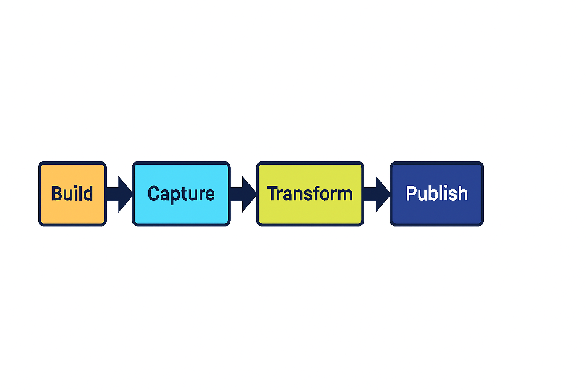

# Content Factor Pipeline Flow

This document illustrates the end‑to‑end lifecycle of the Content Factor pipeline.  
It follows the **Build → Capture → Transform → Publish → Measure** loop, ensuring content moves smoothly from idea to visibility metrics.

---

## 📊 Pipeline Diagram

---

## 📖 Stage Legend

- **Build (orange)**  
  Define the structure, scaffolding, and templates. This is where ideas are framed and the foundation for content is laid.

- **Capture (cyan)**  
  Gather raw material—whether that’s notes, drafts, or external inputs. The goal is to collect without worrying about polish.

- **Transform (yellow‑green)**  
  Shape the captured material into the right format. Apply design tokens, formatting, or logic to make it consistent and usable.

- **Publish (deep blue)**  
  Push the transformed content out to its destination—whether that’s a dashboard, a repo artifact, or a public channel.

- **Measure (pink)**  
  Close the loop by tracking performance and visibility. Feed metrics back into the system to inform the next Build cycle.

---

## 🔑 Key Takeaways

- The pipeline is **modular**: each stage can be improved independently.  
- The loop is **iterative**: measurement informs the next build.  
- The system is **documented**: future contributors can onboard quickly with this visual + text pairing.

---
