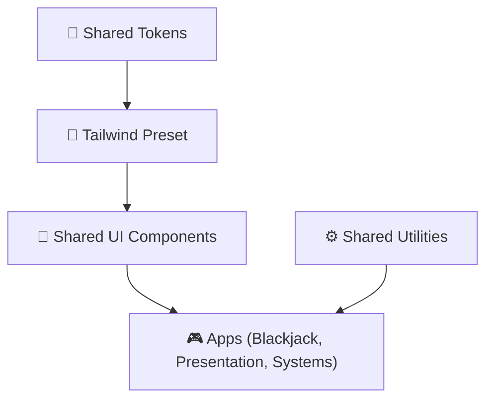

# So they “speak” — A Systems Narrative

Excellent — you’re approaching this the *right* way: not just documenting your system, but **writing a story about how it thinks**.

That’s the exact bridge between *technical writing* and *systems storytelling*.

Let’s go deeper into **how to write your docs, tables, and diagrams so they “speak” like a systems narrative** — something that both technical peers *and* reviewers at companies like Evolution Gaming or Vercel would find compelling.

---

## 🧭 1. The Story You’re Telling

Every project narrative should read like this:

> “Here’s how this system is organized,
> 
> 
> here’s *why* it’s organized this way,
> 
> and here’s *what that means* for scalability, design, and collaboration.”
> 

Your **monorepo documentation** isn’t just a manual — it’s an **argument** that:

- you understand modular design principles,
- you can communicate architectural intent, and
- you think in *systems*, not just in files and functions.

The *story arc* is:

1. **World Setup** – Define what this project is trying to solve. (The “why”)
2. **Structure Reveal** – Show the architecture, patterns, and dependencies. (The “how”)
3. **Resolution** – Explain the outcomes, benefits, and future adaptability. (The “so what”)

---

## 🧩 2. The “Narrative Anatomy” of Great Docs

Each doc, table, or diagram should have three parts:

| Section | What It Does | Example for Your Repo |
| --- | --- | --- |
| **Presentation** | Visual or structural representation (diagram, code snippet, table) | Mermaid diagram of the monorepo |
| **Interpretation** | Explains what we’re looking at and its purpose | “This diagram shows how shared-tokens flow through Tailwind to all apps.” |
| **Implication** | Why this matters, what it enables, what trade-offs exist | “Centralizing tokens improves design consistency but requires coordinated releases.” |

That third step — **Implication** — is where 90% of engineers stop, but great technical writers continue.

---

## 🧱 3. Turning Diagrams Into Narrative

Let’s take your **Monorepo Architecture Diagram** as an example:

**Diagram:**



**Interpretation:**

> This architecture visualizes the flow of visual and logical dependencies in the monorepo. Design tokens define base variables, which are converted into Tailwind themes and then consumed by UI components used across apps.
> 

**Implication:**

> The structure ensures consistency, fast iteration, and scalable theming. If a token changes (say, brand color), every app inherits it automatically. However, this coupling means token updates must follow semantic versioning and proper testing before release.
> 

By narrating like this, you’re showing both *architectural literacy* and *systemic awareness* — which is gold for hiring managers or portfolio reviewers.

---

## ✍️ 4. Writing Style Checklist (from *Technical Writing for Dummies* + modern doc style)

✅ **Active voice, present tense:**

> “The shared-tokens package defines…” not “was defined.”
> 

✅ **Chunk your content:**

Use 2–4 sentence paragraphs. Each should have one core idea.

✅ **Avoid bare instructions:**

Instead of “Run pnpm build,” say “Run `pnpm build` to compile all workspaces in dependency order, ensuring changes in `shared-ui` cascade properly.”

✅ **Follow every table or diagram with a short “Why it matters” section.**

✅ **Label diagrams narratively:**

Use emojis and short phrases for clarity (e.g., 🎨 “Design Layer Flow” is easier to recall than “System Diagram #4”).

✅ **Connect levels:**

Relate a technical detail to its strategic outcome:

> “TypeScript references don’t just improve builds — they signal deliberate dependency control.”
> 

---

## 🧠 5. Becoming Conscious: Daily Writing Habits

Here’s how to *practice systems-level writing* every day:

1. **Keep a “Docs Journal”** — After each coding session, write two lines:
    - *What changed?*
    - *Why it matters to the system.*
        
        This trains you to narrate your technical reasoning.
        
2. **Read source docs with a “meta eye”** — Don’t just read Tailwind or React docs for content; analyze how *they explain* — sentence rhythm, use of visuals, narrative flow.
3. **Rewrite your own README monthly** — Treat it like a living essay on your architecture’s evolution.
4. **Tell your repo’s story aloud** — If you can *say it clearly*, you can *write it clearly*.
5. **Study great doc writers**:
    - Tailwind’s prose style (simple, confident, minimal jargon)
    - Vercel’s architecture docs (visual-first, story-backed)
    - Shopify’s Polaris design system docs (tone: empathetic, structured)

---

## 📖 6. What You’re Actually Practicing

You’re developing four meta-skills of elite technical communicators:

1. **Structural clarity** — seeing systems as interdependent modules
2. **Technical literacy** — translating architecture into language
3. **Rhetorical framing** — writing persuasively to multiple audiences
4. **Narrative empathy** — anticipating what others don’t yet understand

---

## ✨ Next Step

If you’d like, I can create a **writing template for all your architecture docs** — something like:

```markdown
# Diagram: [Title]
*(1 sentence summary)*

```mermaid
...

```

**Context:**

Explain what this diagram shows in plain terms.

**Analysis:**

Why this structure, what design choices it reflects.

**Implications:**

Trade-offs, scalability, maintainability, or UX impact.

**Next:**

Optional link to a related section or module.

```

Would you like me to generate this **“Story-Driven Tech Docs Template”** for your `/docs/modules` folder so that every diagram, table, and note follows your storytelling framework?

```