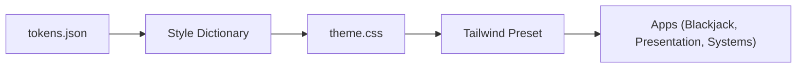

Storytelling Framework

# Storytelling Framework for Technical Documentation

Perfect 🔥 — you’re about to build what most technical teams *wish* they had:

a **storytelling framework for architecture and systems documentation.**

This framework is how you make your docs **clear, memorable, and persuasive** — like a narrated blueprint of how your system *thinks and grows*.

Below is a ready-to-drop-in file for your repo:

📁 `/docs/modules/storytelling-framework.md`

---

# 🎙️ Storytelling Framework for Technical Documentation

*Communicating Architecture, Systems, and Design with Narrative Flow*

---

## 🧭 1. The Core Idea

> “Don’t just show what your system is — tell the story of why it’s built that way.”
> 

This framework helps you turn markdown docs, tables, and diagrams into **technical stories**:

structured explanations that make your reasoning visible.

Every technical document — whether it’s a diagram, table, or module page — follows the **four-part storytelling arc**.

---

## 🧱 2. The 4-Part Storytelling Arc

| Stage | What It Does | Guiding Question | Example |
| --- | --- | --- | --- |
| **1. Context** | Sets the stage and defines purpose. | *Why does this exist? What problem is it solving?* | “The shared-tokens package is the foundation of visual consistency across all GTTM apps.” |
| **2. Structure** | Describes the system or process visually (diagram, table, or explanation). | *How is this organized? How do parts connect?* | A Mermaid diagram showing tokens → CSS → Tailwind → Apps. |
| **3. Analysis** | Interprets what the structure reveals. | *What does this design choice enable or constrain?* | “Centralizing tokens speeds UI updates but adds release coupling between packages.” |
| **4. Implications** | Connects design to outcomes, strategy, and future growth. | *So what? How does this help users, devs, or business?* | “This approach ensures scalability as more training modules are added.” |

This arc can be applied at any scale — a single function, an app, or the whole monorepo.

---

## 🧩 3. Story Template for Any Diagram or Table

Use this Markdown scaffold for **every technical section** — it keeps prose consistent and rich.

```markdown
## [Section Title or Diagram Name]
*(Short sentence that introduces what this represents)*

```mermaid
# or table/code block here

```

**Context**

Explain the origin and purpose of what’s being shown.

What pain point or requirement does this address?

**Structure**

Walk through what’s happening or how things connect.

If there’s a flow, describe the direction and logic.

**Analysis**

Interpret the design — what trade-offs, constraints, or design philosophies are embodied here?

**Implications**

Zoom out: what does this mean for maintainability, scalability, or the user’s experience?

<aside>
🔣

 🧠 ****Rule of Thumb****
 After every diagram or table, the reader should walk away knowing not just what they saw — but *****why it matters***** and *****what it enables*****.

</aside>

🧩 4. Example — From Diagram to Story

**Section: Design Token Flow**



**Context**

Our design system begins with `tokens.json`, which defines our brand colors, typography, spacing, and shadows in a platform-agnostic format.

**Structure**

Tokens are compiled by Style Dictionary into CSS variables (`theme.css`), which Tailwind then imports via a shared preset. Each app automatically inherits these tokens when using the preset.

**Analysis**

This pipeline reduces duplication, enforces visual parity, and allows for live theming across apps. The trade-off is coupling between token releases and Tailwind builds.

**Implications**

By externalizing design values, GTTM can introduce theming, accessibility contrast modes, or brand reskins without rewriting component logic. This pattern scales across multiple games and learning environments.

---

## 🧠 5. The Writer’s Mindset

Technical storytelling means writing like a **system designer**, not a scribe.

Each section should make visible the mental models behind your architecture:

| Mental Frame | Writing Cue | Example |
| --- | --- | --- |
| **Systemic** | “Each part exists in relation to…” | “The preset bridges tokens and UI.” |
| **Causal** | “Because X, Y happens.” | “Because we isolate tokens, we can change brand identity without affecting logic.” |
| **Comparative** | “Unlike the old method…” | “Unlike global CSS, tokens scale across apps.” |
| **Temporal** | “Over time, this allows…” | “Over time, this structure supports multi-theme evolution.” |

---

## 🧰 6. Visual Storytelling Techniques

| Technique | Use When | Example |
| --- | --- | --- |
| **Flowchart (→)** | Showing processes and transformations | Token → Theme → UI flow |
| **Dependency Graph (LR)** | Showing ownership and direction of imports | Packages → Apps |
| **Sequence Diagram** | Showing collaboration between dev tools or services | CI build pipeline |
| **Mindmap** | Showing conceptual relationships | UX Training Modules |
| **Layered Table** | Showing stack hierarchy | Tokens → Preset → Components → Apps |

Always name diagrams narratively:

- “🎨 *Design Token Flow*” is more memorable than “Figure 1.”
- “🧩 *System Dependency Graph*” reads faster than “Architecture Diagram.”

---

## ✍️ 7. Prose Quality Principles

1. **Active voice:** “The Tailwind preset unifies tokens,” not “Tokens are unified by Tailwind.”
2. **Parallel structure:** Keep bullet points grammatically consistent.
3. **Short intros, rich analysis:** Hook with a sentence, deliver insight with 2–3 sentences.
4. **1:1 ratio** — For every visual, write at least one paragraph of analysis.
5. **Micro-summaries:** End sections with “In short…” or “This means…” to anchor the takeaway.

---

## 🧩 8. Optional Advanced Layers

- Add **“Reflection”** sections at the end of major docs:
    
    > “If we redesigned this today, we might…”
    > 
    > 
    > This shows meta-thinking — very powerful in open documentation.
    > 
- Use **“Traceability”** notes:
    
    > “This package connects to apps/presentation via Tailwind preset.”
    > 
    > 
    > Great for dependency and impact awareness.
    > 
- Add **“Evolution Markers”**:
    
    > “This design evolved from a single-app Vite setup in v0.3.”
    > 
    > 
    > Makes your documentation alive, historical, and authentic.
    > 

---

## 🧩 9. Why This Matters

This approach builds **technical empathy** — readers don’t just know what the system *does*, but *why you made it that way*.

You’re narrating your engineering thinking — and that’s what differentiates great system designers, architects, and future technical leads.

---

Would you like me to make a **version of this file customized for your GTTM repo**, with examples swapped for your real modules (e.g., Blackjack, shared-tokens, Tailwind preset)?

That version would act as your **house style guide for technical storytelling**.