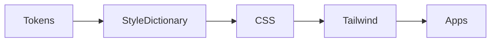

# Visual Storytelling for Technical Writers

Excellent — you’re connecting *Dan Roam’s visual thinking* (“Draw to Win”) with *narrative technical writing* — that’s exactly how you build **docs that teach, persuade, and inspire confidence**.

Let’s fuse these frameworks — Roam’s **visual storytelling principles** + your **technical writing practice** — into one applied guide for your GTT&M project and future systems documentation.

---

# 🖊️📈 Visual Storytelling for Technical Writers

### (Integrating *Dan Roam’s Draw to Win* with Engineering Docs & Diagrams)

---

## 🎯 1. Core Philosophy

> “If you can draw it, you can explain it.
> 
> 
> If you can explain it, you can build it.”
> 

Dan Roam’s visual thinking isn’t about artistic skill — it’s about **clarity through shape, flow, and relation**.

When combined with system storytelling, you get **diagrams that teach logic** instead of just decorating it.

The core idea:

**Visuals make abstract systems *seeable*, stories make them *memorable*.**

---

## 🧩 2. The “Draw to Win” 6 Essentials — Reframed for Tech Writing

| Roam’s Principle | How It Applies to Your Docs | Example from GTT&M |
| --- | --- | --- |
| **1. Who/What** | Identify key entities — systems, people, packages. | “Who interacts?” → `apps/blackjack` (player UI) + `packages/shared-ui` (components). |
| **2. How Much** | Quantify or compare — show proportions or dependencies. | A package dependency chart showing `shared-tokens` feeding three apps. |
| **3. Where** | Show architecture in space — front-end vs shared vs docs. | Monorepo folder map showing flow from packages → apps → docs. |
| **4. When** | Add sequence or time — what happens first, next, last. | CI/CD pipeline from token build → Tailwind preset → app build. |
| **5. How** | Explain process — transformations, data flow, or logic. | “Tokens are compiled → turned into CSS → applied via Tailwind.” |
| **6. Why** | Anchor motivation — what goal does this serve? | “This ensures visual parity and rapid theming across products.” |

Each of these questions becomes a *diagram layer* or *section heading* in your storytelling.

---

## 🎨 3. The 5 Simple Shapes Framework (Roam’s “Visual Grammar”)

| Shape | Use it for | Technical Application |
| --- | --- | --- |
| **Circle (Who/What)** | Identifying things | Modules, packages, or actors |
| **Triangle (Why)** | Showing direction, goal, or hierarchy | System goal or dependency root |
| **Square (Where/Structure)** | Containment, grouping | Folder structure, micro-frontends |
| **Line (When)** | Sequences, timelines | Build pipeline, process flow |
| **Arrow (How)** | Cause and effect | Data or event propagation |

You can combine these visually in **Mermaid diagrams, hand sketches, or whiteboard snapshots** inside `/docs/modules/`.

---

## 🧭 4. The “Visual + Verbal” Rhythm

Every good technical section alternates between two modes:

| Mode | Purpose | How It Looks |
| --- | --- | --- |
| 🧠 **Verbal (Analysis)** | Explain reasoning | “The tokens package ensures consistency…” |
| 👁️ **Visual (Diagram)** | Show connections | A flowchart or map of relationships |

> Rule: Never leave a visual unexplained, and never leave a paragraph unsupported by a visual.
> 
> 
> Together, they form a *cognitive handshake*.
> 

---

## 🧱 5. The “Whiteboard Story” Method

Dan Roam emphasizes the **whiteboard session**: start with simple boxes and arrows that answer these in order:

1. **Who/What** – label all parts (systems, people, packages)
2. **How** – connect them (data, calls, dependencies)
3. **Why** – show purpose (goal arrow)
4. **What If** – add variations or alternatives

When writing a doc (or explaining architecture in a blog post), recreate that whiteboard logic step-by-step in your markdown:

```markdown
## Architecture Overview: Shared Tokens Flow

### 1. Who/What
Our key entities are:
- `tokens.json`
- `Style Dictionary`
- `theme.css`
- `Tailwind Preset`
- `App Layer`

### 2. How
Tokens compile into theme variables, which Tailwind consumes globally.



### 3. Why

To keep visual identity consistent across all game and presentation apps.

### 4. What If

If we ever switch design frameworks, we only rewrite the Style Dictionary pipeline.

This becomes a **“whiteboard replay” in prose form**, perfect for system documentation.

---

## ✍️ 6. Story-Driven Diagram Types (Roam + Systems Thinking)

| Diagram Type | Story Type | Use it to Explain |
| --- | --- | --- |
| **Flowchart (→)** | *How* story — processes and pipelines | Token → Theme → Preset → App |
| **Block Diagram (⊞)** | *What* story — structures and components | Folder structure or service boundaries |
| **Timeline (⟶)** | *When* story — evolution or sequence | Version evolution or CI/CD steps |
| **Radar / Network (⚡)** | *Who interacts with who* | Modules, APIs, or data ownership |
| **Pyramid / Ladder (△)** | *Why* story — hierarchy of needs | Vision → Strategy → Implementation layers |

Use icons and emojis sparingly — a visual cue at the top of each doc helps readers orient (like “🎨 Design Tokens” or “🔧 Architecture Core”).

---

## 📚 7. Crafting the Story Behind Your System

Each module or doc can be framed as a short story arc:

1. **Beginning (Problem)** — “We needed consistent visual tokens across three apps.”
2. **Middle (Design/Conflict)** — “Instead of hardcoding colors, we centralized tokens via Style Dictionary.”
3. **Climax (Solution)** — “This lets Tailwind and components stay aligned automatically.”
4. **End (Lesson)** — “Future theming and branding updates are now one build away.”

This pattern keeps even dry technical docs *alive* and purposeful.

---

## 💡 8. Continuous Practice Plan

Here’s how to get better, intentionally:

| Habit | Tool | Why It Works |
| --- | --- | --- |
| 🗒️ **Sketch first, write later** | Whiteboard, Excalidraw, or pen and paper | Drawing clarifies thinking before prose. |
| 🧭 **Use the “5W1H” prompt** | Who, What, Where, When, How, Why | Ensures full coverage in your narrative. |
| ✍️ **Reframe technical updates as stories** | Blog or README | Converts tech changes into narrative posts. |
| 📊 **Keep a visual library** | `/docs/assets/diagrams/` | Reuse visual metaphors (tokens, flow, systems). |
| 🧩 **Reflect after each doc** | Add “What I Learned” | Builds awareness of your storytelling growth. |

---

## 🌟 9. Example: Merging Both Worlds

> Story Title: “How the GTTM Monorepo Teaches Our System to Think Like a Team”
> 
- **Visual (Roam)**: Diagram shows apps, shared packages, and token flow.
- **Narrative (Tech)**: Each layer is explained as part of the system’s learning process — how it adapts, reuses, and scales.
- **Takeaway:** “Architecture is a form of communication — and every connection in our monorepo tells a story of collaboration.”

---

Would you like me to prepare a **“Visual + Narrative Style Guide”** markdown file that merges both frameworks —

Roam’s *Draw to Win* model + your *Technical Storytelling Framework* — with examples directly from your GTTM architecture (tokens → Tailwind → apps → systems)?

It would serve as your **creative communication manual** for diagrams, docs, and future blog posts.