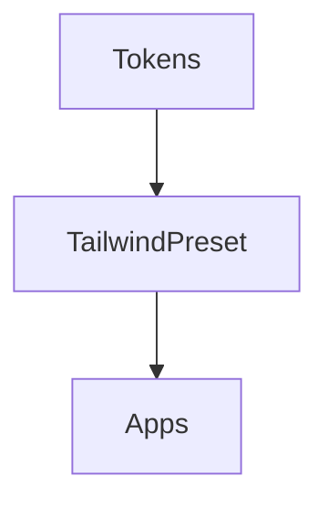

# Writing GPS — Creative Technical Document Template

# ✍️ Writing GPS — Creative Technical Document Template

> A repeatable framework for writing README files, blog posts, internal docs, or case studies
> 
> 
> Inspired by *Everybody Writes* (Ann Handley) + *On Writing Well* (Zinsser) + GTTM storytelling principles
> 

---

## 🧭 1. Purpose & Context

**Goal:**

What are you trying to achieve with this piece?

- Inform, explain, persuade, document, or teach?

**Audience:**

Who are you writing for?

- What do they know?
- What do they care about?
- What will success look like for them?

**Outcome:**

What do you want your reader *to do* after reading?

---

## 🧱 2. Core Message

> The single sentence that holds the piece together.
> 
> 
> Example: “This document shows how our design tokens system automates brand consistency across all apps.”
> 
- One-line thesis:
- Supporting idea #1:
- Supporting idea #2:
- Supporting idea #3:

---

## 🎬 3. Story Frame

### Situation → Conflict → Resolution → Lesson

| Phase | Description | Example (Technical Context) |
| --- | --- | --- |
| **Situation** | What is the world before your solution? | “Design tokens were scattered across apps.” |
| **Conflict** | What problem breaks the status quo? | “Brand updates caused inconsistencies.” |
| **Resolution** | How did you solve or change it? | “We introduced a shared tokens package and build pipeline.” |
| **Lesson** | What did we learn / what’s next? | “Centralized tokens improved velocity and coherence.” |

Add a 2–3 sentence paragraph per phase.

---

## 🧩 4. Structure & Flow

**Suggested sections (adapt as needed):**

1. Introduction / Hook — Why this matters
2. Background / Context
3. The Problem (conflict)
4. The Solution (process, design, architecture)
5. The Outcome (metrics, impact, takeaways)
6. Next Steps / Reflection

---

## 🎨 5. Visual Story (Optional)

> Every diagram should be followed by a short rationale.
> 

**Diagram Type:** (System / Flow / Concept / Roadmap)

**Tool:** (Mermaid / Excalidraw / Figma / PlantUML / etc.)

**Diagram Placeholder:**

